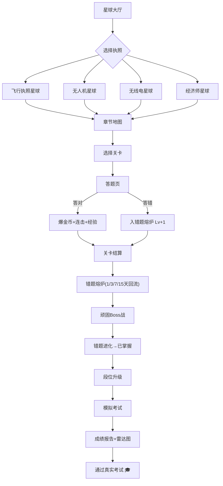

# 「考证星球」产品需求文档（PRD）

## 1. 产品概述

「考证星球（CertPlanet）」是一款以**太空赛博朋克**为美术风格的多感官、强游戏化考证刷题+记忆软件，把枯燥应试变成"打怪升级"的上瘾循环。
- **核心目标**：让用户通过闯关、错题熔炉、模拟考试、3D空间操作、AI记忆口诀等多元手段，以远低于传统备考的痛苦度通过专业执照考试。
- **首批支持的执照**：飞行执照（PPL）、无人机执照（CAAC）、无线电执照（HAM A/B/C）、中级经济师。
- **目标用户**：考证人群（18-50岁），痛点是枯燥死记硬背、缺乏动力、错题反复错、备考战线长。

## 2. 核心功能

### 2.1 用户角色
| 角色 | 注册方式 | 核心权限 |
|------|----------|----------|
| 宇航员（普通用户） | 本地匿名注册（自动生成ID） | 全部学习、刷题、错题、模拟考试、3D空间、宠物、签到、段位 |
| 访客 | 无需注册 | 仅可预览星球大厅、试玩3题 |

> 当前版本不联网对战，所有用户数据存储于本地（IndexedDB + LocalStorage）。

### 2.2 功能模块

1. **星球大厅（首页）**：4颗执照星球悬浮，宠物+金币+段位+连签火苗
2. **学习中心**：知识树闯关 / 每日挑战 / 模拟考试 / 错题熔炉
3. **记忆工坊**：AI口诀 / 知识图谱 / 闪卡速记
4. **模拟空间**：3D驾驶舱、3D空域、3D天线、3D经济沙盘
5. **我的基地**：宠物养成、装备、成就墙、数据中心
6. **答题内核**：单选/多选/判断三种题型，连击/暴击/掉落奖励

### 2.3 页面详情
| 页面名称 | 模块名称 | 功能描述 |
|----------|----------|----------|
| 星球大厅 | 4颗星球 | 点击进入对应执照；显示该执照进度环、征服度 |
| 星球大厅 | 顶部状态栏 | 金币、经验、段位徽章、连签火苗、宠物头像 |
| 星球大厅 | 每日任务卡片 | 3个限时任务，完成后爆金币 |
| 星球大厅 | 签到日历 | 7天连续签到奖励 |
| 章节地图 | 知识树 | 章节节点+关卡点+Boss关，按章节顺序解锁 |
| 章节地图 | 关卡类型 | 普通关 / 精英关 / Boss关 / 隐藏关 |
| 答题页 | 题干+选项 | 单选/多选/判断；倒计时；连击Combo；朗读按钮 |
| 答题页 | 答案反馈 | 答对爆金币+音效+粒子；答错心跳音+红屏抖动+入错题熔炉 |
| 答题页 | 解析面板 | 折叠展开；含AI口诀、关联知识点链接 |
| 错题熔炉 | 错题列表 | 按等级(Lv1/Lv2/Lv3顽固)分组；显示下次复习时间 |
| 错题熔炉 | 顽固错题Boss战 | 每周一次集中挑战顽固错题 |
| 错题熔炉 | 错题进化 | 连续答对N次后进化为"已掌握"，永久金币加成 |
| 模拟考试 | 全真模式 | 限时、计分、交卷后报告 |
| 模拟考试 | 成绩报告 | 总分、章节正确率、错题分布、雷达图 |
| 记忆工坊 | AI口诀库 | 每个知识点配2-3个口诀，可投票收藏 |
| 记忆工坊 | 知识图谱 | 3D力导向图，未掌握节点闪红光 |
| 记忆工坊 | 闪卡速记 | 左右滑动，配合粒子特效 |
| 模拟空间 | 3D驾驶舱（飞行） | 旋转查看6仪表，点击识别 |
| 模拟空间 | 3D空域塔（无人机） | 拖拽无人机判断限飞区 |
| 模拟空间 | 3D天线方向图（无线电） | 旋转天线看辐射图变化 |
| 模拟空间 | 3D经济沙盘（经济师） | 拖拽参数实时看IS-LM曲线动 |
| 我的基地 | 宠物养成 | 喂养升级、解锁技能、随行答题 |
| 我的基地 | 装备商店 | 皮肤/头像框/特效，用金币兑换 |
| 我的基地 | 成就墙 | 已解锁徽章，未解锁暗化 |
| 我的基地 | 数据中心 | 学习曲线、章节热力图、遗忘曲线 |
| 设置 | 声音开关 | 音效/朗读/背景音独立控制 |
| 设置 | 数据管理 | 导出/导入JSON备份 |

## 3. 核心流程

### 3.1 主用户流程
新用户首次进入 → 看到星球大厅4颗星球 → 选择无人机星球 → 进入章节地图 → 完成首关 → 获得金币+宠物蛋 → 答错的题进入错题熔炉 → 第二天打开App收到错题复习推送 → 错题进化后获得永久金币加成 → 周末参加顽固错题Boss战 → 累积经验升段位 → 模拟考试通过率逐步提升 → 真实考试通过。



### 3.2 错题进化流程
答错 → 错题入熔炉(Lv1) → 第1天复习答对 → 第3天复习答对 → 第7天复习答对 → 第15天复习答对 → 进化为"已掌握" → 永久金币加成+5%

### 3.3 成瘾回路（短期/中期/长期）
- **短期（每题）**：爆金币+连击Combo+暴击概率+音效反馈
- **中期（每天/每周）**：签到火苗+每日任务+周排名+顽固Boss战
- **长期（每执照）**：星球征服勋章+段位制+宠物进化+装备解锁

## 4. 用户界面设计

### 4.1 设计风格
**主题：太空赛博朋克（Cyberpunk Space）**
- **主色**：深空蓝紫渐变 `#0a0e27` → `#1a1147` → `#2d1b69`
- **强调色1**：霓虹粉 `#ff2e88`（CTA、正确反馈）
- **强调色2**：电光青 `#00f5ff`（次级按钮、链接、连击）
- **强调色3**：金黄 `#ffd700`（金币、稀有掉落）
- **危险色**：警示红 `#ff3860`（错误、Boss）
- **辅助色**：紫罗兰 `#9d4edd`、星尘白 `#e0e0ff`

**按钮风格**：
- 主按钮：粉/青双色边框+发光阴影+轻微3D凸起
- 次按钮：玻璃拟态半透明背景+发光描边
- 卡片：玻璃拟态+渐变边框+悬浮发光

**字体**：
- 标题：`Orbitron`（赛博朋克感强，几何感）
- 副标题/数字：`Rajdhani`（科技感等宽变体）
- 正文：`Noto Sans SC`（中文清晰）
- 等宽数字：`JetBrains Mono`

**布局**：
- 桌面优先（1280px+）
- 卡片化栅格 + 顶部状态栏 + 左侧导航
- 大量留白 + 渐变光晕背景
- 粒子层覆盖全屏

**图标/Emoji**：
- 执照图标：✈️ 🚁 📡 💼
- 货币：🪙 💎 ⭐
- 状态：🔥（连签）⚡（连击）🌟（暴击）

### 4.2 页面设计概览
| 页面名称 | 模块名称 | UI元素 |
|----------|----------|--------|
| 星球大厅 | 4颗星球 | Three.js 3D悬浮球，霓虹光晕环，轨道线，进度环 |
| 星球大厅 | 顶部状态栏 | 玻璃拟态胶囊，金币/段位/火苗数字滚动 |
| 星球大厅 | 签到日历 | 7格卡片，已签点亮金色，未签暗紫 |
| 章节地图 | 知识树 | 节点连线，已通过节点绿色脉冲，未解锁暗化，Boss关红色光环 |
| 答题页 | 题干区 | 大字号玻璃卡片，朗读波形动画 |
| 答题页 | 选项 | 4个胶囊按钮，hover发光，选中霓虹边框 |
| 答题页 | Combo显示 | 屏幕右上角，5连击后字体放大+抖动 |
| 错题熔炉 | 错题列表 | 火焰背景，等级徽章 Lv1/Lv2/Lv3 红色等级条 |
| 模拟考试 | 倒计时 | 顶部红色数字大字+进度环 |
| 模拟考试 | 成绩雷达图 | 6维章节雷达图，霓虹描边 |
| 3D模拟空间 | 驾驶舱 | Three.js 3D仪表盘，OrbitControls可旋转 |
| 我的基地 | 宠物 | 像素+霓虹混合风宠物立绘 |
| 数据中心 | 热力图 | GitHub风格贡献热力图，霓虹色阶 |

### 4.3 响应式设计
- **桌面优先**：1280px+全功能展示，3D空间操作完整
- **平板（768-1280px）**：保留3D，导航折叠为底部Tab
- **移动端（<768px）**：3D简化为2D视图，触摸优化（按钮最小44px），底部Tab栏
- **触摸优化**：长按删除、左滑切换、双指捏合缩放

### 4.4 3D 场景指引
**环境与氛围**：
- HDRI：星空+紫色星云环境贴图
- 光照：1个主方向光（蓝白冷光）+ 2个点光源（粉/青霓虹辅光）
- 后处理：Bloom（霓虹辉光）+ Chromatic Aberration（轻微色差）+ Vignette（暗角）

**相机**：
- 星球大厅：缓慢自动环绕+用户拖拽控制
- 驾驶舱：第一人称视角固定+头部摇摆
- 经济沙盘：俯视45°角，鼠标拖拽参数面板

**性能预算**：
- 单场景三角面 < 50k
- 60fps（桌面）/ 30fps（移动端降级）
- 使用 instancing 复用粒子，避免每帧创建几何体

## 5. 题库与记忆算法

### 5.1 题库数据
- 飞行执照 PPL：约 86 题（9 章节）
- 无人机 UAV：约 90 题（9 章节）
- 无线电 HAM：约 80 题（8 章节）
- 经济师 ECO：约 88 题（6 大部分）

每题字段：id, category, question, options[], answer, explanation, mnemonic(可选AI口诀), difficulty(1-5), related_knowledge[]

### 5.2 间隔重复算法（SM-2 改良）
```
- 每题初始强度 ef = 2.5
- 答对：quality q ∈ [0,5]
  - q>=3：ef = ef + (0.1 - (5-q)*(0.08 + (5-q)*0.02))
  - interval: 1天 → 3天 → 7天 → 15天 → 30天...
- 答错(q<3)：interval 重置为 1，ef -= 0.2（不低于 1.3）
- 难度自适应：连续答对3次降低出现频率
```

### 5.3 AI 记忆口诀
- 内置口诀模板库：谐音梗 / 故事场景 / 顺口溜 / 公式联想法
- 关键词提取后自动匹配模板生成口诀
- 用户可投票，得分高的口诀被推荐

## 6. 成瘾机制详细规格

### 6.1 经济系统
| 货币 | 获取方式 | 用途 |
|------|----------|------|
| 🪙 金币 | 答题+1，连击+bonus，每日任务+50，签到+10~100 | 购买装备、宠物饲料、复活错题进化 |
| 💎 钻石 | 段位升级、星球征服、成就解锁 | 高级皮肤、稀有宠物蛋 |
| ⭐ 经验 | 答题+5，关卡通过+50 | 升段位 |
| 🔥 火苗 | 连续学习天数 | 段位光环、签到倍率 |

### 6.2 段位制
青铜 → 白银 → 黄金 → 铂金 → 钻石 → 星耀 → 考证王者（每段1000经验）

### 6.3 宠物系统
- 4种基础宠物：火箭喵（飞行）、无人机狗（无人机）、电波兔（无线电）、算盘龙（经济师）
- 升级解锁技能：双倍经验卡(1次/天)、免错一次(1次/天)、复活一次
- 宠物跟随答题，正确时跃起，错误时垂头

### 6.4 暴击与连击
- 5% 概率暴击：双倍奖励+全屏金光特效
- Combo 计数：连续答对+1，答错清零
- Combo 奖励层级：5/10/20/50/100 不同全屏特效

## 7. 数据存储

所有用户数据存储于浏览器本地：
- `IndexedDB`：题库缓存、答题记录、错题、3D资源缓存
- `LocalStorage`：用户配置、宠物状态、签到、段位、当前会话
- `Export/Import JSON`：手动备份与迁移

## 8. 性能指标

- 首屏加载（LCP）：< 2.5s（桌面）
- 答题切换延迟：< 100ms
- 3D场景帧率：桌面 60fps / 移动 30fps
- 离线可用：PWA + Service Worker 缓存

## 9. 不在本期范围
- ❌ 联网对战（V2 引入）
- ❌ 用户账号体系（V3 引入）
- ❌ 题库众包与社区口诀（V4 引入）
- ❌ iOS/Android 原生 App（V5 PWA 替代）
