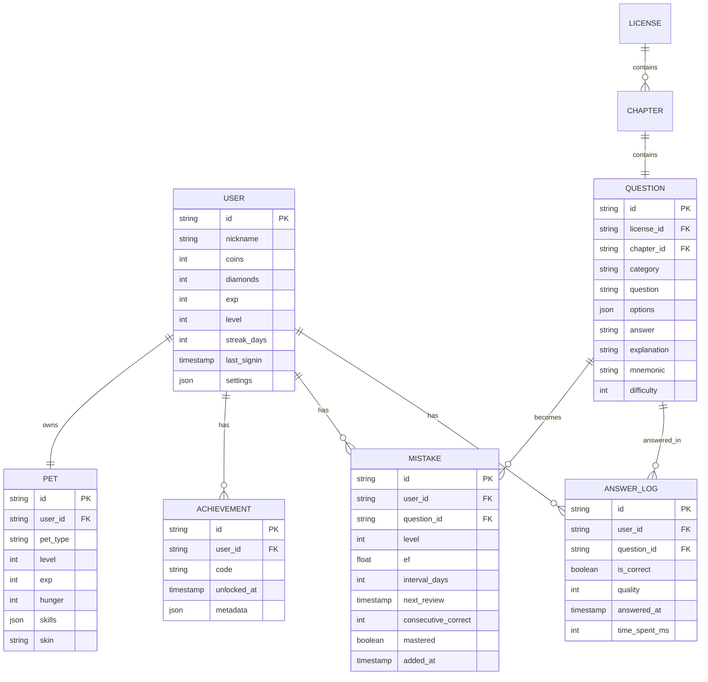

# 「考证星球」技术架构文档

## 1. 架构设计

```mermaid
graph TB
    subgraph "前端层（浏览器）"
        UI[React UI 组件层]
        Router[React Router 路由]
        State[Zustand 状态管理]
        Query[TanStack Query 缓存]
    end
    subgraph "业务逻辑层"
        Game[游戏化引擎<br/>金币/连击/段位/宠物]
        SR[间隔重复算法 SM-2]
        Audio[音频引擎 Howler.js]
        Anki[错题熔炉/闪卡引擎]
    end
    subgraph "3D 渲染层"
        R3F[React Three Fiber]
        Drei[@react-three/drei]
        Post[@react-three/postprocessing]
    end
    subgraph "数据层（纯本地）"
        IDX[(IndexedDB<br/>题库+答题记录)]
        LS[(LocalStorage<br/>配置+宠物+段位)]
        JSON[题库 JSON 静态资源]
    end
    subgraph "外部资源"
        CDN[字体 CDN: Orbitron/Rajdhani]
    end

    UI --> Router
    UI --> State
    UI --> Query
    State --> Game
    State --> SR
    State --> Anki
    UI --> Audio
    UI --> R3F
    R3F --> Drei
    R3F --> Post
    Query --> IDX
    State --> LS
    JSON --> Query
    UI -.-> CDN
```

## 2. 技术栈说明

| 层 | 技术选型 | 版本 |
|----|----------|------|
| 构建工具 | Vite | ^5.0 |
| 框架 | React | ^18.3 |
| 语言 | TypeScript | ^5.4 |
| 样式 | Tailwind CSS | ^3.4 |
| 状态管理 | Zustand | ^4.5 |
| 路由 | React Router | ^6.23 |
| 数据请求/缓存 | TanStack Query | ^5.40 |
| 3D 引擎 | Three.js + React Three Fiber + drei + postprocessing | latest |
| 音频 | Howler.js | ^2.2 |
| 动画 | Framer Motion | ^11 |
| 图表 | Recharts | ^2.12 |
| 数据库（浏览器端） | Dexie.js（IndexedDB 封装） | ^4.0 |
| PWA | vite-plugin-pwa | ^0.20 |
| 测试 | Vitest | ^1.6 |

**初始化工具**：vite-init（react-ts 模板）
**后端**：无（纯前端 + 静态题库 JSON）
**数据库**：浏览器本地 IndexedDB + LocalStorage

## 3. 路由定义

| 路由 | 用途 | 关键模块 |
|------|------|----------|
| `/` | 星球大厅（首页） | 4颗星球、状态栏、签到、每日任务 |
| `/license/:licenseId` | 章节地图 | 知识树、关卡解锁 |
| `/quiz/:nodeId` | 答题页 | 题干、选项、连击、解析 |
| `/mistakes` | 错题熔炉 | 错题列表、进化状态、Boss战 |
| `/exam` | 模拟考试 | 倒计时、答题、交卷 |
| `/exam/result` | 考试成绩 | 总分、雷达图、章节分析 |
| `/memory` | 记忆工坊 | 口诀库、知识图谱、闪卡 |
| `/space/:licenseId` | 3D模拟空间 | 4种执照对应3D场景 |
| `/base` | 我的基地 | 宠物、装备、成就 |
| `/base/data` | 数据中心 | 学习曲线、热力图 |
| `/settings` | 设置 | 声音、数据管理 |

## 4. 数据模型

### 4.1 IndexedDB 表结构（Dexie）



### 4.2 LocalStorage 键值

| Key | 类型 | 用途 |
|-----|------|------|
| `cp_user` | object | 当前用户基本信息（id/nickname/coins/exp/level） |
| `cp_settings` | object | 音效开关、朗读开关、背景音开关、主题 |
| `cp_signin` | object | 签到记录（last_date, streak_days, claimed_today） |
| `cp_session` | object | 当前答题会话（combo, current_question_id, score） |
| `cp_pet` | object | 当前激活宠物状态 |
| `cp_daily_tasks` | object | 每日任务完成状态 |

## 5. 核心模块设计

### 5.1 游戏化引擎（gameEngine.ts）
```typescript
interface GameState {
  coins: number;
  diamonds: number;
  exp: number;
  level: number;
  rank: Rank; // 青铜/白银/.../考证王者
  combo: number;
  maxCombo: number;
  streakDays: number;
}
interface GameActions {
  addCoins(n: number, reason: string): void;
  addExp(n: number): void;
  breakCombo(): void;
  increaseCombo(): { combo: number; bonus: number; isCrit: boolean };
  claimSignin(): { coins: number; days: number };
  upgradeRank(): void;
}
```

### 5.2 间隔重复算法（srs.ts）
```typescript
interface SRSCard {
  questionId: string;
  ef: number;       // 难度系数 1.3~2.5
  interval: number; // 下次复习间隔（天）
  repetitions: number;
  nextReview: number; // timestamp
  mastered: boolean;
}
function review(card: SRSCard, quality: 0|1|2|3|4|5): SRSCard
// quality: 0完全忘记 1错了但见过 2错了但接近 3犹豫但对了 4对了但费力 5轻松答对
```

### 5.3 音频引擎（audio.ts）
- 音效：correct.wav / wrong.wav / coin.wav / levelup.wav / combo.wav / button.wav
- 背景音：space_ambient.mp3（4 种执照对应不同氛围）
- TTS：使用浏览器原生 `SpeechSynthesisAPI` 朗读题干与解析

### 5.4 3D 场景组件
- `SpaceHallScene`：4颗执照星球悬浮
- `Cockpit3D`：飞行执照 3D 驾驶舱
- `DroneCity3D`：无人机 3D 城市空域
- `Antenna3D`：无线电 3D 天线方向图
- `Economy3D`：经济师 3D 经济沙盘

## 6. 项目目录结构

```
/workspace
├── index.html
├── package.json
├── vite.config.ts
├── tailwind.config.js
├── tsconfig.json
├── public/
│   ├── sounds/
│   │   ├── correct.mp3
│   │   ├── wrong.mp3
│   │   ├── coin.mp3
│   │   ├── levelup.mp3
│   │   └── ambient-*.mp3
│   └── manifest.webmanifest
├── src/
│   ├── main.tsx
│   ├── App.tsx
│   ├── index.css
│   ├── data/
│   │   ├── licenses.ts           # 4 个执照元数据
│   │   ├── chapters/             # 各执照章节
│   │   └── questions/
│   │       ├── ppl.json
│   │       ├── uav.json
│   │       ├── ham.json
│   │       └── eco.json
│   ├── db/
│   │   └── dexie.ts              # IndexedDB schema
│   ├── store/
│   │   ├── gameStore.ts          # Zustand: 金币/连击/段位
│   │   ├── userStore.ts
│   │   ├── petStore.ts
│   │   └── settingsStore.ts
│   ├── engine/
│   │   ├── srs.ts                # SM-2 算法
│   │   ├── gameEngine.ts
│   │   └── audio.ts
│   ├── components/
│   │   ├── ui/                   # 按钮/卡片/Toast
│   │   ├── layout/               # Header/Sidebar/TabBar
│   │   ├── effects/              # 粒子/Combo/Bloom
│   │   └── three/                # 3D 场景
│   ├── pages/
│   │   ├── Hall.tsx              # 星球大厅
│   │   ├── ChapterMap.tsx        # 章节地图
│   │   ├── Quiz.tsx              # 答题页
│   │   ├── Mistakes.tsx          # 错题熔炉
│   │   ├── Exam.tsx              # 模拟考试
│   │   ├── ExamResult.tsx
│   │   ├── Memory.tsx            # 记忆工坊
│   │   ├── Space3D.tsx           # 3D模拟空间
│   │   ├── Base.tsx              # 我的基地
│   │   ├── DataCenter.tsx        # 数据中心
│   │   └── Settings.tsx
│   └── utils/
│       ├── format.ts
│       └── mnemonic.ts           # AI口诀生成
└── .trae/documents/
    ├── PRD.md
    └── TechnicalArchitecture.md
```

## 7. 性能与体验优化

- **代码分割**：3D 场景、答题页、考试页均使用 `React.lazy` 懒加载
- **题库预加载**：进入执照后 dexie 批量插入题库
- **3D 性能**：使用 `instancedMesh` 渲染粒子，`<AdaptiveDpr>` 自适应分辨率
- **音频**：Howler.js 预加载关键音效，背景音乐流式加载
- **PWA**：Service Worker 缓存题库 JSON 与音频，离线可答全部题目

## 8. 测试策略

- 单元测试：`srs.ts`、`gameEngine.ts`、`mnemonic.ts`
- 组件测试：答题页、错题熔炉列表渲染
- E2E（可选）：星球大厅 → 答题 → 错题 → 进化 全流程
